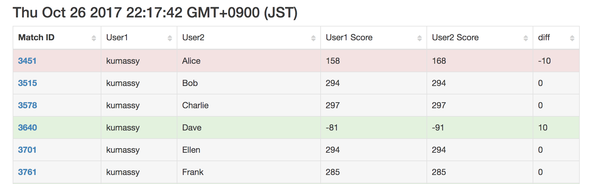
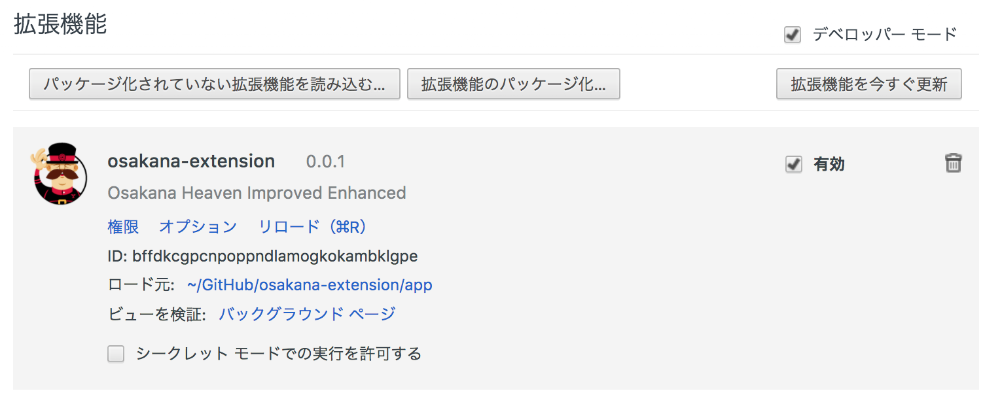
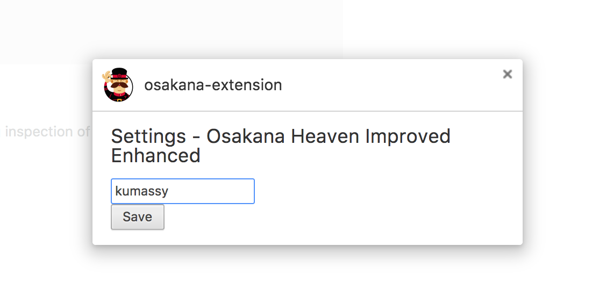

# osakana-extension
Osakana Heaven が捗るかもしれない Chrome の拡張機能です。この拡張機能は次の機能を提供します：

- Ranking で、自分の行をハイライト
- Match History で
  - 勝敗に応じて行をハイライト
  - スコアの差の列を追加
  - ソート機能
- osakana の回転



## 自分でビルドしてインストール
### ビルド
```
git clone https://github.com/Kumassy/osakana-extension
cd osakana-extension
npm install
gulp build
```

### Chrome に追加
「メニュー」→「その他のツール」→「拡張機能」  
「パッケージ化されていない拡張機能を読み込む」


`osakana-extension/app` を追加


## 自分でビルドしないでインストール
https://github.com/Kumassy/osakana-extension/archive/v0.0.2.zip
をダウンロードして `app.crx` を取り出す。

「メニュー」→「その他のツール」→「拡張機能」  
`app.crx` をドラッグ＆ドロップ


## 設定
「メニュー」→「その他のツール」→「拡張機能」  
「オプション」


Osakana Heaven のユーザー名を入れて Save
